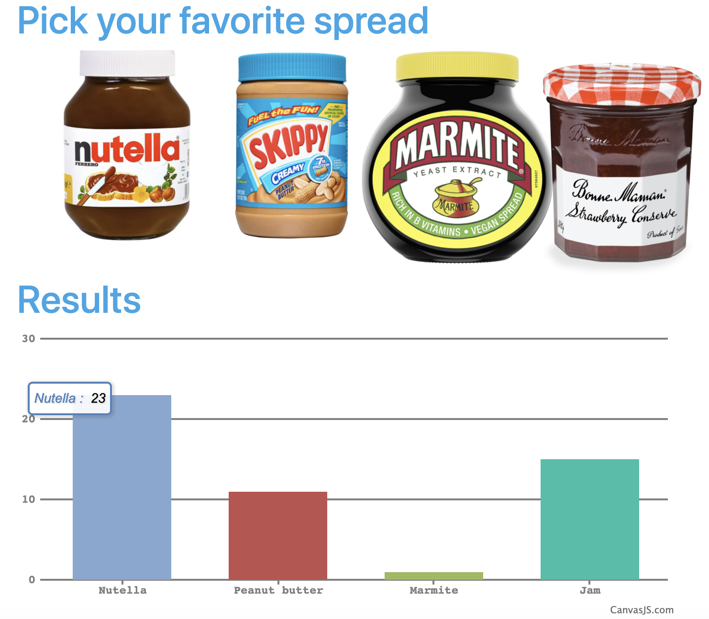

Quarkus Poll Application
================================

Poll application to vote for your favorite spread. This project illustrates how you can interact with Apache Kafka using MicroProfile Reactive Messaging and Hibernate with Panache.



It's derived from the Quarkus [kafka-quickstart](https://github.com/quarkusio/quarkus-quickstarts/tree/master/kafka-quickstart) and [kafka-panache-quickstart](https://github.com/quarkusio/quarkus-quickstarts/tree/master/kafka-panache-quickstart) examples, as well as this *[Build a live poll using Node.js](https://pusher.com/tutorials/live-poll-nodejs)* article.

## Infrastructure

You need a PostgreSQL instance and a Kafka broker.
To start them, just run `docker-compose up -d`.

## Start the application

The application can be started using:

```bash
mvn quarkus:dev
```

Then, open your browser to `http://localhost:8080/`, and you should access a poll to vote for your favorite spread.
Every time you click on the image of your favorite spread, a new vote is cast, sent to a Kafka topic, received by a Kafka consumer and written to the database, then sent back to an in-memory channel. The vote is then broadcast to all connected browsers via a Server-Sent Event.
The chart updates in realtime as the votes are cast.

## Anatomy

* `PollResource`: handles several REST endpoints to manage the poll.
    - GET `/`: serves the `index.qute.html` template
    - POST `/vote`: pushes an item to the `votes` Kafka topic
    - GET `/votes`: retrieves the votes from the database and returns them as JSON
    - GET `/vote-results`: streams the `poll-results` channel to the clients as Server-Sent Events\
* `VoteConverter` - receives the vote from the `votes` Kafka topic, and updates the tally into the database using Hibernate with Panache, then pushes it the `poll-results` in-memory channel.
* `index.qute.html`: a Qute HTML template, where users can cast their votes for their favorite spreads, and see the results updated in real-time in a chart.
* `app.js`: contains the logic on the client side, to cast votes and update the chart as results come in. *The author being javascript handicapped, don't pay attention to quality the code.*

## Running in native

You can compile the application into a native binary using:

`mvn clean install -Pnative`

and run with:

`./target/poller-1.0-SNAPSHOT-runner`